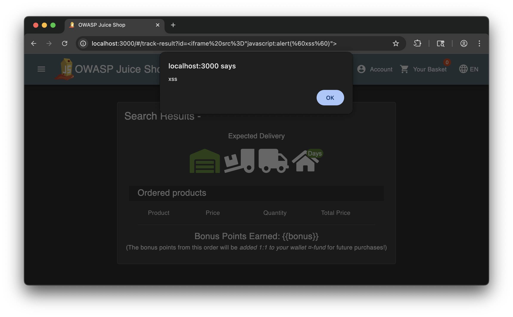

# XSS

## 1. Exploitation Activity

### DOM-Based XSS

The exploitation of this vulnerability in **OWASP Juice Shop** was relatively straightforward.

According to PortSwigger, DOM-based XSS vulnerabilities arise when:

> JavaScript takes data from an attacker-controllable source, such as the URL, and passes it to a sink that supports dynamic code execution.

The first step was to identify a suitable injection point. DOM-based XSS is **more likely in applications that heavily rely on client-side rendering**, which suggested focusing on the **main page where all products are displayed**.

The most obvious injection point was the **search bar**. After submitting a search query (e.g., *“apple”* or *“banana”*), the application reflects the searched term on the page as a header. This behavior indicates that user-controlled input is rendered directly in the DOM.

The exploit consisted of injecting the following payload into the search bar:

```html
<iframe src="javascript:alert(`xss`)"></iframe>
```

After pressing Enter, the search results page loaded and displayed a popup alert containing the text `xss`, along with an empty iframe rendered next to the *Search Result* header:


This confirms the presence of a DOM-based XSS vulnerability.

---

### Reflected XSS

Exploiting the reflected XSS vulnerability was less straightforward and required additional exploration.

As suggested by the challenge hints, the goal was to identify a **URL parameter that could serve as the injection source**, other than the commonly used `search?q=` parameter. This parameter was discovered by navigating to the **Order History** page (`/order-history`). Clicking the **truck icon** redirected the application to an order tracking page with the URL format:

```
/track-result?id=<order-id>
```

Returning to the home page and manually modifying the URL to:

```
localhost:3000/track-result?id=<iframe%20src%3D"javascript:alert(%60xss%60)">
```

resulted in a page that triggered a popup alert displaying `xss`, along with an empty iframe rendered next to the *Search Result* header:


This confirms a reflected XSS vulnerability via the `id` URL parameter.

---

## 2. Under the Hood

### Reflected XSS

The reflected XSS vulnerability can be identified by inspecting the source code responsible for handling order tracking requests.

Since the relevant HTML element does not expose a clear `id`, the investigation focused on the client-side logic in `main.js`. The parameter `track-result` is referenced in the `trackOrder` function, which includes the following navigation call:

```js
return yield o.router.navigate(['track-result']), {
```

This function is later invoked with a parameter named `orderId`, which is extracted from the URL query string using:

```js
this.route.snapshot.queryParams.id
```

The extracted `orderId` value is then passed to the following function:

```js
bypassSecurityTrustHtml(`<code>${e.data[0].orderId}</code>`)
```

This function belongs to Angular’s **DOM Sanitizer**. According to Angular documentation:

> **bypassSecurityTrustHtml**
> Bypasses Angular’s built-in sanitization and trusts the given value as safe HTML. This method should only be used when the developer is certain that the content is safe, as it disables XSS protection.

The trusted value is subsequently injected—without further validation—into the `innerHTML` property of a DOM element using the `Y8G` function. As a result, any malicious payload embedded in the `orderId` parameter is rendered and executed by the browser, leading to the reflected XSS vulnerability.

---

### DOM-Based XSS

This DOM-based XSS vulnerability can be classified as a **reflected DOM XSS**.

The input provided through the search bar is URL-encoded and appended to the URL as the value of the `q` query parameter. When the page is refreshed without a search term, the client requests all items from the server using an empty `q` parameter. However, when a search is performed, no new server request is issued; instead, the cached data is filtered and displayed client-side.

Inspection of the page’s HTML reveals that the heading displaying the search term has the `id` attribute `searchedValue`. In `main.js`, a variable with a corresponding name is assigned a value using `bypassSecurityTrustHtml`, similarly to the reflected XSS case.

This value is then assigned to the `innerHTML` of the header element using the `Y8G` function. Because no additional sanitization is performed, any HTML or JavaScript code included in the `q` parameter becomes part of the DOM and is executed by the browser.

This vulnerability qualifies as DOM-based XSS because the malicious payload is entirely handled and executed on the client side, with the attacker controlling the input through the search bar.
