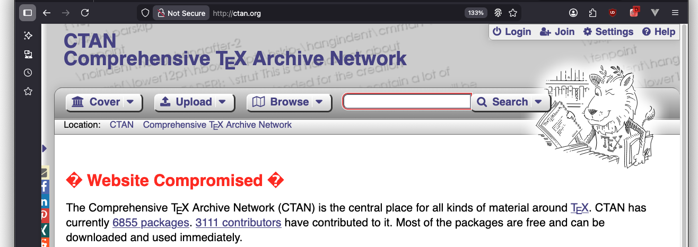
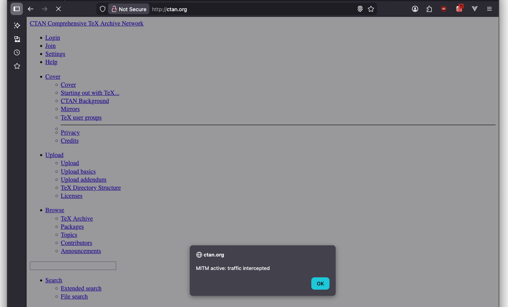
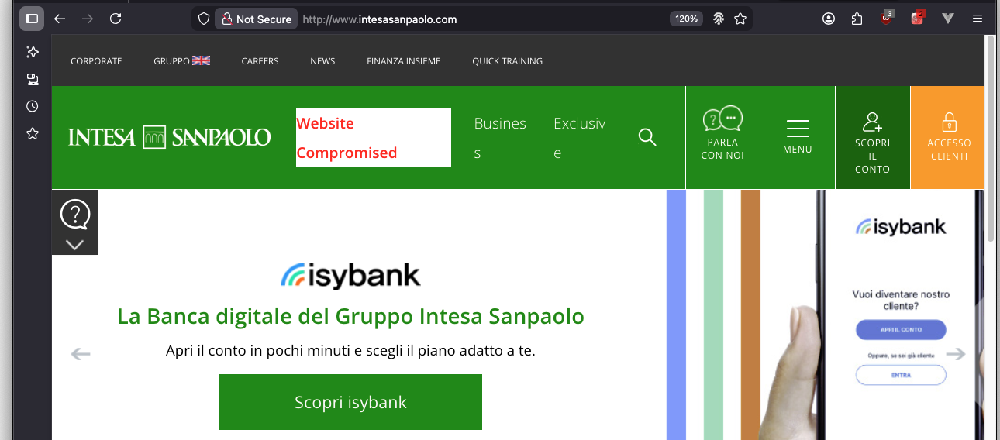
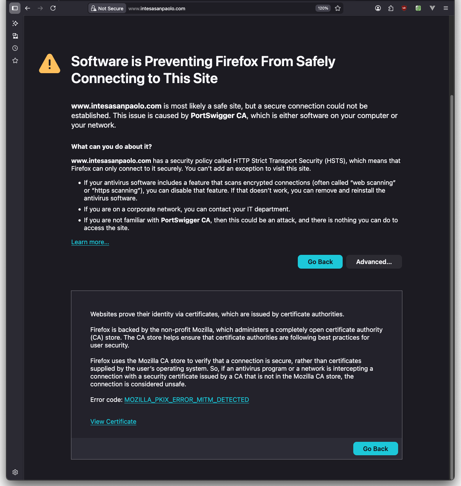

# Adversary-in-the-Middle (AITM)

## Setup

To configure **Burp Proxy** for performing **SSLstrip-style attacks**, the following steps were carried out:

* Force the use of TLS on the proxy listener by modifying the listener interface
* Enable **Remove Secure flag from cookies**
* Enable **Convert HTTPS links to HTTP**
* Add a *Match and Replace* rule to remove the `Strict-Transport-Security` response header
* Add a *Match and Replace* rule to remove the `Content-Security-Policy` response header

---

## CTAN.ORG

**CTAN** (Comprehensive TeX Archive Network) is the main archive for TeX packages. It hosts packages, documentation, wikis, and additional resources related to TeX.
At the time of the experiment, the website did **not** include `Strict-Transport-Security` (HSTS) response headers.

---

### Modifying Selected Portions of the Response

By using *Match and Replace* rules, it is possible to modify arbitrary parts of the HTML response. For example, the page header can be replaced with:

```html
<h1 style="color:red">⚠ Website Compromised ⚠</h1>
```

This modification results in the following rendered page:



---

### Stealing Credentials

User credentials can be intercepted by observing POST requests sent to:

```
ctan.org/k_spring_security_check
```

The credentials are transmitted in the request body and can be extracted directly from intercepted traffic.

---

### JavaScript Injection

Using *Match and Replace* rules, arbitrary JavaScript can be injected into the page. For example:

```html
<script>alert("MITM active: traffic intercepted");</script></body>
```

This injection produces the following result:



More complex scripts could be injected to perform additional malicious actions, such as:

* Reading or modifying cookies
* Manipulating page content programmatically
* Exfiltrating user data

---

### Cookie Manipulation

Session cookies can be extracted from intercepted requests and reused to perform **session hijacking**.

To demonstrate this, the browser’s developer tools can be used to manually insert the captured cookie into the storage section. Once the cookie is set, the attacker can access the website as the victim without reauthentication.

---

### Download Link Manipulation

Download links can be altered to perform **supply chain** or **integrity compromise** attacks.
A *Match and Replace* rule can be used to modify the download URL, for example:

```html
<a href="http://lab.local/payloads/fake_update.txt">Download</a>
```

This causes the victim to download a malicious file instead of the legitimate package.

---

## INTESASANPAOLO.COM

### Without HSTS

If the website is accessed **before** the `Strict-Transport-Security` policy is enforced by the browser, no security warning is displayed and content manipulation is possible.

For instance, an HTML element can be replaced with:

```html
<a href="/it/persone-e-famiglie.html" class="active"
   id="vtdd24bddcae08cd92a7a19736df002e2e60bdc2ddfd81f525b3b8dda43a185470"
   style="color:red; font-weight:bold">
   Website Compromised
</a>
```

This results in the following modified page:



---

### With HSTS

After accessing the website securely over HTTPS **without** the proxy, the browser successfully receives and enforces the `Strict-Transport-Security` header.

This behavior can be verified by subsequently attempting to visit the HTTP version of the site while connected to the proxy:



At this point, the browser prevents navigation entirely. The connection cannot be downgraded to HTTP, and the attack cannot be bypassed by adding browser exceptions.